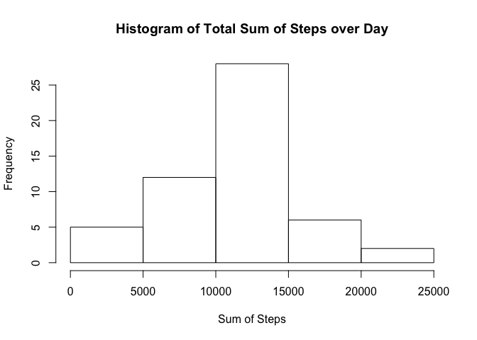
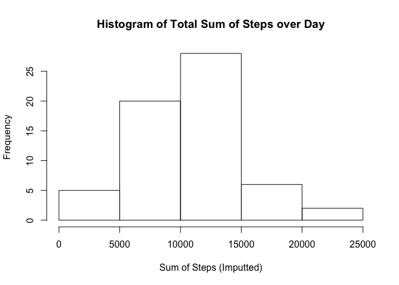
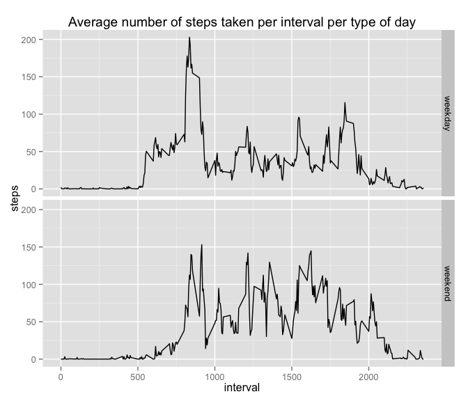

# Reproducible Research: Peer Assessment 1


## Loading and preprocessing the data

### Preparation

Download activity monitoring data from this source: https://d396qusza40orc.cloudfront.net/repdata%2Fdata%2Factivity.zip and unzip it. The following code assumes that the csv file contained in the zip is within the working directory.

### Processing


```r
activity = read.csv("activity.csv", header=TRUE, sep=",", na.strings ="NA")
activity$date = as.Date(activity$date)
activity_noNA = na.omit(activity)
```

The code snippet above loads the activity file and corrects the date column to the data type date. 
It generates two main data frames: **activity** which contains the raw data read in from the file and **activity_noNA** which contains the raw data cleared off all missing measurements.

## What is mean total number of steps taken per day?

### Preparation
The data frame **activity_noNA** needs to be initialized.

### Processing


```r
day_total <- aggregate(. ~ date, data=activity_noNA, sum)
day_mean <- mean(day_total$steps)
day_median <- median(day_total$steps)
hist(day_total$steps, xlab="Sum of Steps", main="Histogram of Total Sum of Steps over Day")
```

 

The code above calculates the sum of steps per day and stores it in **day_total**. This is used to calculate the mean, median, and a histogram over the days.

### Discussion
The histogram shows that for the majory of days, the number of steps taken range between 10000 and 15000 steps. The mean number is 1.0766189\times 10^{4} and the median is 10765. 

Please note that this leaves out intervals where no measurement was done. This might lead to a bias as it might increase the number of steps of certain days.

## What is the average daily activity pattern?

### Preparation

Again the calculation is based on the **activity_noNA** data frame which leaves out incomplete measurements.

### Processing


```r
interval_avg <- aggregate(. ~ interval, data=activity_noNA[,c("steps","interval")], mean)
max_interval_avg <- max(interval_avg$steps)
interval_max_avg <- interval_avg[which.max(interval_avg$steps),c("interval")]
plot(interval_avg$interval, interval_avg$steps, type="l", xlab="5-minute Interval over day", ylab="Average steps taken", main="Average number of steps taken in interval")
```

 

The code above calculates the mean over the **activity_noNA** data frame aggregating over the interval. Using the results, the maximum and the interval of its occurrence is calculated. Finally, a plot is done.

### Discussion

The graph shows nicely typical sleeping times (up to interval 500 representing 500 times 5 minutes of the day). In the morning than activity increases up to its local maximum of 206.1698113 at 835. Around interval 2000 the daily activity throttles down and leaves into the night.

Again we took the data frame neglecting imcomplete measurements which might lead to a bias.


## Imputing missing values

### Preparation
The results of the average steps per interval calctulation and the raw data set need to be provided.

### Processing


```r
replace_NA <- function(interval_input) { interval_avg[interval_avg$interval==interval_input,c("steps")]}

steps_imp <- apply(activity, 1, function(x) if(is.na(x["steps"])) {replace_NA(x["interval"])} else {x["steps"]} )
steps_imp <- as.numeric(steps_imp)
steps_imp[is.na(steps_imp)] <- 0

activity_imp <- activity
activity_imp$steps <- unlist(steps_imp)
day_imp_total <- aggregate(. ~ date, data=activity_imp, sum)

day_imp_mean <- mean(day_imp_total$steps)
day_imp_median <- median(day_imp_total$steps)

hist(day_imp_total$steps, xlab="Sum of Steps (Imputted)", main="Histogram of Total Sum of Steps over Day")
```

 

The code above uses the mean number of steps per interval to fill in missing measurements with the mean number of steps of the respective interval. A data frame **activity_imp** is generated that reflects the raw data merged with the extrapolated data points. This data frame is then used to aggregate the sum over the day, calculate mean and median again as well as plot a histogram.

### Discussion

The mean is 1.0221929\times 10^{4}and the median is 1.0395\times 10^{4} which is lower than the values in the raw data frame. This indicates that especially during intervals of lower than average activity measurements were missing. This can also be seen on the histogram. The bar representing the 5000 to 10000 steps intervals is relatively higher compared to the maximum than within the raw dataset. 


## Are there differences in activity patterns between weekdays and weekends?

### Preparation

The following calculation uses the data frame with imputted measurements replacing the missing measurements from the raw data frame. 

### Processing


```r
weekend_days <- c("Saturday","Sunday")
activity_imp$type_day <- apply(activity_imp,1,function(x) if(weekdays(as.POSIXlt(x["date"])) %in% weekend_days) "Weekend" else "Weekday")
activity_imp$type_day <- factor(activity_imp$type_day)
activity_imp_weekend <- subset(activity_imp, type_day == "Weekend")
activity_imp_weekday <- subset(activity_imp, type_day == "Weekday")

interval_imp_avg_weekend <- aggregate(. ~ interval, data=activity_imp_weekend[,c("interval","steps")], mean)
interval_imp_avg_weekend$type_day = "weekend"

interval_imp_avg_weekday <- aggregate(. ~ interval, data=activity_imp_weekday[,c("interval","steps")], mean)
interval_imp_avg_weekday$type_day = "weekday"

interval_imp_avg <- rbind(interval_imp_avg_weekday,interval_imp_avg_weekend)

interval_imp_avg$type_day <- factor(interval_imp_avg$type_day)

max_interval_imp_avg_weekend <- max(interval_imp_avg_weekend$steps)
max_interval_imp_avg_weekday <- max(interval_imp_avg_weekday$steps)

sum_interval_imp_avg_weekend <- sum(interval_imp_avg_weekend$steps)
sum_interval_imp_avg_weekday <- sum(interval_imp_avg_weekday$steps)

library(ggplot2)

ggplot(interval_imp_avg, aes(x=interval,y=steps)) + facet_grid(type_day~.) + ggtitle("Average number of steps taken per interval per type of day") + geom_line()
```

 

The code defines Saturday and Sunday as the weekend, all other days are seen as weekdays. According to the date in the measurement, the day of the week is calculated by using the ***weekdays*** function and assigned as a factor to the ***type_day*** column. Then two data frames are generated; one containing all measurments done during a weekend day and one containing the others. Using these data frames, the respective maximum number of steps is calculated and the steps are aggregated over the respective interval. The latter is plotted to compare weekends and weekdays.

### Discussion

During the weekday, the activity starts earlier than on weekends. While on weekends the activity is more evenly distributed between the start in the morning and starting to rest in the evening, weekdays show a distinct maximum in the morning. The maximum average number of steps per interval during the weekend is 153.125 while during the weekday it is 202.8888889. The sum of the average number of steps per interval during the weekend is 1.1682776\times 10^{4} compared to 9702.5165618 during the weekdays. This slight difference might indicate that the participants used the weekends to do some sports.
On weekends the activity takes a bit longer into the night before flattening out.

### Lookout
It would be very interesting to compare individuals and see indications for sport activities. Also, indicators such as age or profession would be interesting to compare.
